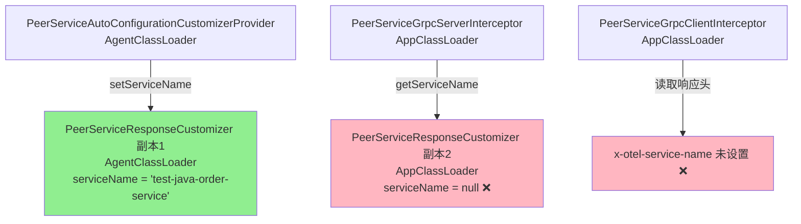
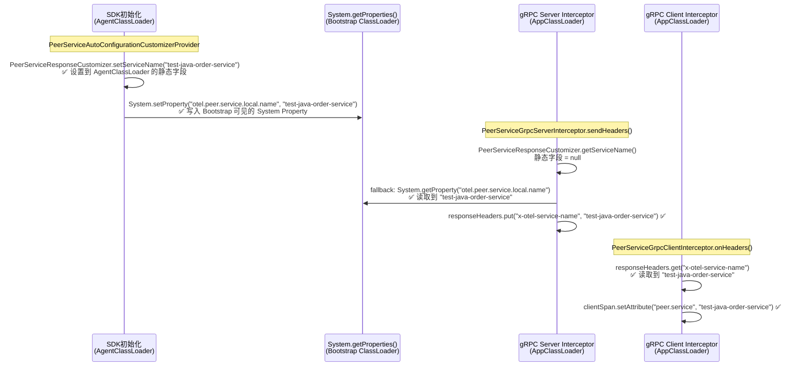
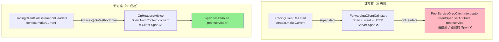
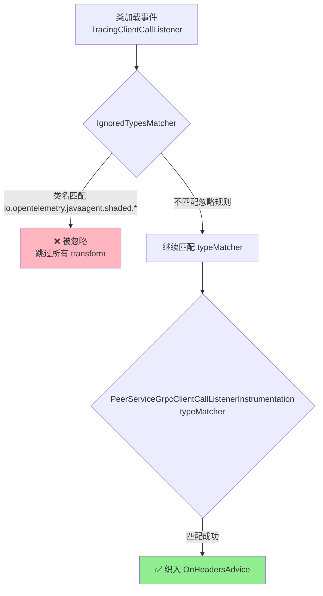
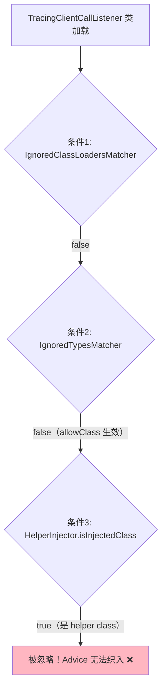
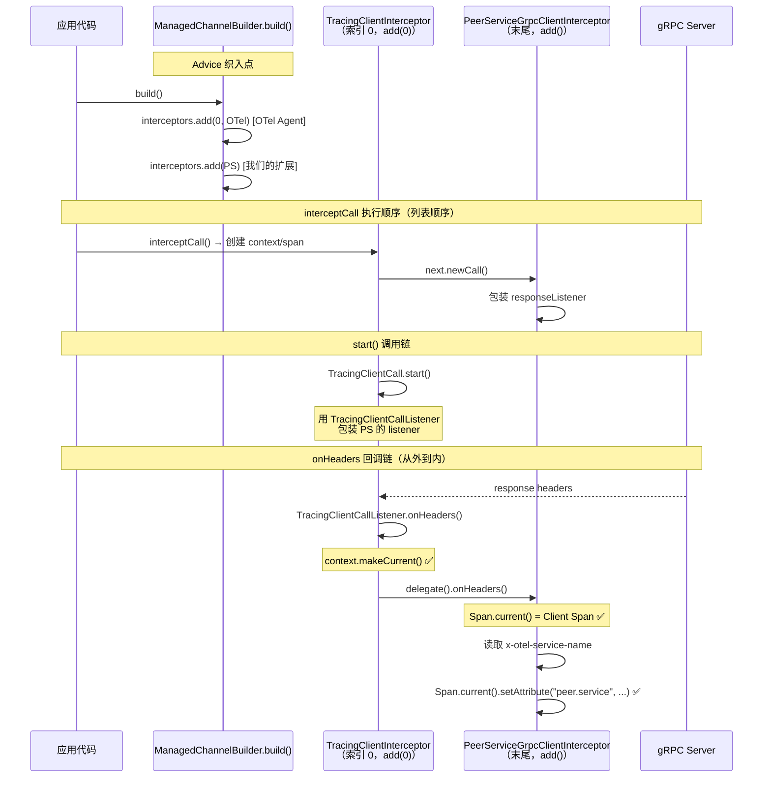

# gRPC Client Span 缺失 peer.service 属性 - ClassLoader 隔离修复

## 需求背景

gRPC 场景下，Client Span 没有被正确设置 `peer.service` 属性。通过 Arthas 诊断发现根因是 **ClassLoader 隔离**导致 `PeerServiceResponseCustomizer.serviceName` 在不同 ClassLoader 中不共享。

## 问题根因



### 详细链路

1. **SDK 初始化阶段**（AgentClassLoader）：`PeerServiceAutoConfigurationCustomizerProvider` 通过 SPI 加载，调用 `PeerServiceResponseCustomizer.setServiceName("test-java-order-service")`，设置到 **AgentClassLoader** 中的 `PeerServiceResponseCustomizer` 静态字段
2. **gRPC Server 端**（AppClassLoader）：`PeerServiceGrpcServerInterceptor` 作为 helper class 被注入到 AppClassLoader，调用 `PeerServiceResponseCustomizer.getServiceName()` 读取的是 **AppClassLoader** 中的副本 → `null`
3. **gRPC Client 端**（AppClassLoader）：`PeerServiceGrpcClientInterceptor` 从响应头中读取 `x-otel-service-name` → 未设置 → `peer.service` 属性缺失

## 解决方案

使用 `System.setProperty()` / `System.getProperty()` 作为跨 ClassLoader 的数据桥梁。`System` 类位于 bootstrap ClassLoader，所有 ClassLoader 共享同一个 `System.getProperties()`。



## 实施进展

### ✅ 已完成

| 文件 | 修改内容 | 状态 |
|---|---|---|
| `PeerServiceResponseCustomizer.java` | `setServiceName()` 同时写入 System Property；`getServiceName()` 增加 fallback 从 System Property 读取并缓存；`customize()` 改为使用 `getServiceName()` | ✅ 已完成 |

### 修改详情

**`PeerServiceResponseCustomizer.java`**：
- 新增常量 `SERVICE_NAME_SYSTEM_PROPERTY = "otel.peer.service.local.name"`
- `setServiceName(String name)`：在设置静态字段的同时，调用 `System.setProperty()` 写入 System Property
- `getServiceName()`：优先返回静态字段值；如果为 null，fallback 到 `System.getProperty()` 读取，并缓存到本地静态字段
- `customize()`：改为调用 `getServiceName()` 方法而非直接读取静态字段，保持一致性

### 设计优势

1. **最小修改范围**：只修改了 `PeerServiceResponseCustomizer` 一个文件，所有调用方（gRPC Server Interceptor、Dubbo Server Filter）自动受益
2. **向后兼容**：不改变任何公共 API，不影响已有的 HTTP 场景
3. **性能友好**：首次 fallback 读取后缓存到本地静态字段，后续调用无需重复读取 System Property
4. **同时修复 Dubbo 场景**：Dubbo Server Filter 同样通过 `PeerServiceResponseCustomizer.getServiceName()` 获取 serviceName，也会自动受益

## 遗留问题

~~暂无~~

### 问题二：gRPC Client Span 的 `Span.current()` 拿到的是 HTTP Server Span

即使 `PeerServiceResponseCustomizer` 的 ClassLoader 隔离问题已修复（Server 端正确写入 `x-otel-service-name` 响应头），Client 端的 `PeerServiceGrpcClientInterceptor` 中 `Span.current()` 仍然拿到的是 HTTP Server Span 而非 gRPC Client Span。

**根因**：`PeerServiceGrpcClientInterceptor` 作为 helper class 被注入到 AppClassLoader，其字节码中的 `Span.current()` 被 shade 为 `io.opentelemetry.javaagent.shaded.io.opentelemetry.api.trace.Span.current()`。虽然 `TracingClientCall.start()` 中的 `context.makeCurrent()` 也使用 shaded 版本的 Context，但由于 ClassLoader 隔离，helper class 中的 `Span.current()` 无法正确获取 Agent 内部设置的 Context，导致始终返回 HTTP Server Span。

**Arthas 诊断确认**：通过 watch `onHeaders` 中 `clientSpan.getName()` 返回 `"GET /order/mockGenerated"`（HTTP Server Span），而非 gRPC Client Span 名称。

## 问题二修复方案：Advice 织入 TracingClientCallListener

### 核心思路

不再使用独立的 `PeerServiceGrpcClientInterceptor`（helper class 方式），改为直接在 OTel 原生的 `TracingClientCallListener` 上织入 Advice。Advice 代码被内联到目标类的字节码中，与 `TracingClientCallListener` 在同一个 ClassLoader 中执行，不存在隔离问题。



### 关键设计

1. **修改 `TracingClientInterceptor.java`**：给 `TracingClientCallListener` 添加 `onHeaders(Metadata)` 方法（与 `onMessage`、`onClose`、`onReady` 保持一致，在 `context.makeCurrent()` 的 scope 内调用 `delegate().onHeaders(headers)`）
2. **创建 `PeerServiceGrpcClientCallListenerInstrumentation`**：在 `TracingClientCallListener.onHeaders()` 上织入 `@Advice.OnMethodEnter`
3. **Advice 通过 `@Advice.FieldValue("context")` 获取 context 字段**：用 `Span.fromContext(context)` 获取正确的 gRPC Client Span，100% 可靠
4. **删除旧的 `PeerServiceGrpcClientInterceptor` 和 `PeerServiceGrpcClientBuilderInstrumentation`**：不再需要独立的 interceptor

### 实施进展

| 文件 | 修改内容 | 状态 |
|---|---|---|
| `TracingClientInterceptor.java` | 给 `TracingClientCallListener` 添加 `onHeaders(Metadata)` 方法 | ✅ 已完成 |
| `PeerServiceGrpcClientCallListenerInstrumentation.java` | 新建，在 `TracingClientCallListener.onHeaders()` 上织入 Advice | ✅ 已完成 |
| `PeerServiceGrpcInstrumentationModule.java` | 替换 `PeerServiceGrpcClientBuilderInstrumentation` 为 `PeerServiceGrpcClientCallListenerInstrumentation` | ✅ 已完成 |
| `PeerServiceGrpcClientInterceptor.java` | 已删除（不再需要） | ✅ 已删除 |
| `PeerServiceGrpcClientBuilderInstrumentation.java` | 已删除（不再需要） | ✅ 已删除 |
| `PeerServiceGrpcServerInterceptor.java` | 更新 Javadoc 引用 | ✅ 已完成 |
| `PeerServiceDubboClientFilter.java` | 更新 Javadoc 引用 | ✅ 已完成 |

### 设计优势

1. **彻底解决 ClassLoader 隔离问题**：Advice 代码内联到 `TracingClientCallListener` 中，与目标类在同一个 ClassLoader 中执行
2. **通过 `@FieldValue("context")` 直接获取 context**：不依赖 `Span.current()`，100% 可靠
3. **代码更简洁**：删除了 2 个不再需要的文件（interceptor + builder instrumentation）
4. **修复了 `onHeaders` 缺少 `context.makeCurrent()` 的遗漏**：与 `onMessage`、`onClose`、`onReady` 保持一致

## 问题三：Advice 未被织入 - IgnoredTypesMatcher 过滤

### 根因

`GlobalIgnoredTypesConfigurer` 中配置了：
```java
builder.ignoreClass("io.opentelemetry.javaagent.shaded.");
```

`TracingClientCallListener` 在 shade 后的类名为 `io.opentelemetry.javaagent.shaded.instrumentation.grpc.v1_6.TracingClientInterceptor$TracingClientCall$TracingClientCallListener`，以 `io.opentelemetry.javaagent.shaded.` 开头，被 ByteBuddy 的 `IgnoredTypesMatcher` 在类加载阶段直接过滤掉，根本不会尝试任何 transform。



### Arthas 诊断过程

1. `sc -d *OnHeadersAdvice*` → rowCount=0（误判为 Advice 未加载）
2. `sc -d` 完整类名 → rowCount=1（Advice 类实际已加载，之前是通配符匹配问题）
3. `jad TracingClientCallListener onHeaders` → 反编译失败（shade 后字节码结构导致 CFR 无法处理）
4. `watch onHeaders` → 确认 `context` 字段类型为 `ArrayBasedContext`，字段列表包含 `parentContext`, `context`, `request`, `this$1`
5. 分析 `GlobalIgnoredTypesConfigurer` 源码 → 发现 `ignoreClass("io.opentelemetry.javaagent.shaded.")` 规则

### 修复方案

创建 `PeerServiceGrpcIgnoredTypesConfigurer`，通过 `allowClass()` 为 `TracingClientCallListener` 添加例外，覆盖全局的 `ignoreClass` 规则。

### 实施进展

| 文件 | 修改内容 | 状态 |
|---|---|---|
| `PeerServiceGrpcIgnoredTypesConfigurer.java` | 新建，使用 `allowClass()` 为 `TracingClientCallListener` 添加忽略例外 | ✅ 已完成 |
| `PeerServiceGrpcClientCallListenerInstrumentation.java` | 修正 `typeMatcher()` 中关于 shade 处理的错误注释 | ✅ 已完成 |

## 问题四：allowClass 无法覆盖 HelperInjector.isInjectedClass 的忽略

### 根因

`AgentInstaller.configureIgnoredTypes()` 中的 ignore 链是 `.or()` 关系：

```java
return agentBuilder
    .ignore(any(), new IgnoredClassLoadersMatcher(...))  // 条件1
    .or(new IgnoredTypesMatcher(...))                     // 条件2 ← allowClass 只能影响这里
    .or((td, cl, m, c, pd) -> HelperInjector.isInjectedClass(cl, td.getName()));  // 条件3
```

`TracingClientCallListener` 是 OTel gRPC instrumentation 的 **helper class**，被 `HelperInjector` 注入到 `AppClassLoader`。条件3 `HelperInjector.isInjectedClass()` 返回 `true`，导致整个 ignore 链返回 `true`，**即使条件2 因为 `allowClass` 返回了 `false`**。



### Arthas 诊断确认

```
ognl helperClassDetector.test(classLoader, className) → true
```

### 修复方案：方案三 — 自定义 ClientInterceptor + ManagedChannelBuilder 织入

**彻底放弃在 `TracingClientCallListener`（helper class）上织入 Advice 的思路**，改为注册自定义的 `PeerServiceGrpcClientInterceptor`。

核心思路：模仿 OTel 原生的 `GrpcClientBuilderBuildInstrumentation`，在 `ManagedChannelBuilder.build()` 上织入 Advice，将自定义 interceptor 添加到 interceptor 列表末尾。



### 关键设计

1. **织入目标**：`ManagedChannelBuilder`（gRPC 库自身的类，不是 helper class）
2. **interceptor 添加位置**：列表末尾（`interceptors.add(...)`），确保在 OTel 之后
3. **onHeaders 中 `Span.current()` 可靠性**：OTel 的 `TracingClientCallListener.onHeaders()` 先执行 `context.makeCurrent()`，然后调用 `delegate().onHeaders()` — 即我们的 listener，此时 `Span.current()` 就是 gRPC Client Span

### 实施进展

| 文件 | 修改内容 | 状态 |
|---|---|---|
| `PeerServiceGrpcClientInterceptor.java` | 新建，自定义 ClientInterceptor，在 onHeaders 中读取 x-otel-service-name 并设置 peer.service | ✅ 已完成 |
| `PeerServiceGrpcClientBuilderInstrumentation.java` | 新建，在 ManagedChannelBuilder.build() 上织入，注册自定义 interceptor | ✅ 已完成 |
| `PeerServiceGrpcInstrumentationModule.java` | 替换 TypeInstrumentation 列表 | ✅ 已完成 |
| `PeerServiceGrpcServerInterceptor.java` | 更新 Javadoc 引用 | ✅ 已完成 |
| `PeerServiceGrpcClientCallListenerInstrumentation.java` | 已删除（不再需要） | ✅ 已删除 |
| `PeerServiceGrpcIgnoredTypesConfigurer.java` | 已删除（不再需要） | ✅ 已删除 |

### 设计优势

1. **完全避开 helper class 问题**：织入的是 gRPC 库自身的 `ManagedChannelBuilder`，不是 helper class
2. **与 OTel Agent 自身的做法一致**：参考 `GrpcClientBuilderBuildInstrumentation`，经过充分验证
3. **架构更简洁**：不需要 `IgnoredTypesConfigurer`，不需要 `allowClass()`
4. **`Span.current()` 在 onHeaders 回调中能正确拿到 gRPC Client Span**：因为 OTel 的 `TracingClientCallListener.onHeaders()` 会先 `context.makeCurrent()`

## 待验证

- [ ] 重新构建 agent jar 并部署到 test-java-order-service
- [ ] 触发 gRPC 请求，验证 Client Span 是否正确设置 `peer.service` 属性
- [ ] 验证 HTTP 场景是否仍然正常工作（回归测试）
- [ ] 验证 Dubbo 场景是否也修复（如有 Dubbo 测试环境）
