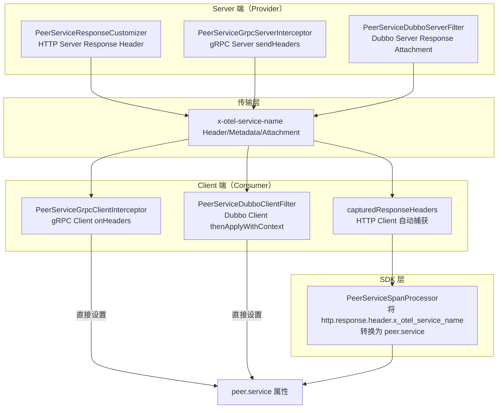
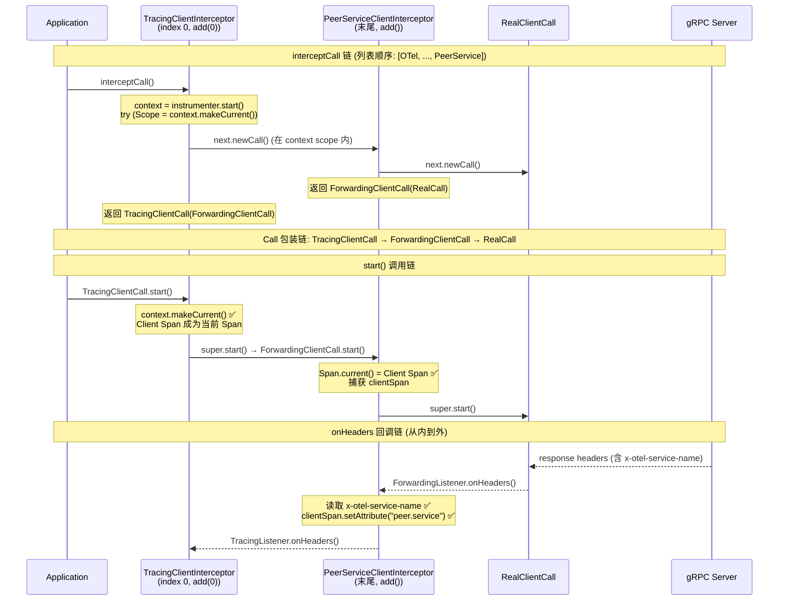

# peer.service 自动补全实施记录

## 需求概述

在 OpenTelemetry Java Instrumentation 中，自动为 Client Span 补全 `peer.service` 属性，使得链路追踪中能够正确显示调用的对端服务名。

覆盖三种 RPC 场景：
- **HTTP**：通过 `capturedResponseHeaders` + `SpanProcessor` 机制
- **gRPC**：通过自定义 `ClientInterceptor` / `ServerInterceptor`
- **Dubbo**：通过 Dubbo SPI Filter 机制

## 架构设计

## gRPC 实现细节

### interceptor 注入与调用链

### 关键设计决策

1. **interceptor 追加到列表末尾**（`interceptors.add(...)` 而非 `add(0, ...)`）
   - OTel 原生使用 `add(0)` 将 `TracingClientInterceptor` 插入到列表头部
   - 我们使用 `add()` 追加到末尾，确保 PeerService interceptor 在 OTel 之后
   - 这样 `TracingClientCall` 包装 `ForwardingClientCall`，`start()` 调用链中 `context.makeCurrent()` 先于我们的 `Span.current()` 执行

2. **Span 在 `start()` 中捕获**（而非 `interceptCall()` 中）
   - `interceptCall()` 中 OTel 的 `context.makeCurrent()` scope 在 `next.newCall()` 返回后就关闭了
   - `start()` 中 `TracingClientCall.start()` 会重新 `context.makeCurrent()`，在其 scope 内调用 `super.start()`

## Dubbo 实现细节

### 关键设计决策

1. **不依赖 `onResponse` 回调**，改为在 `invoke()` 中通过 `AsyncRpcResult.thenApplyWithContext()` 自行注册回调
   - `ProtocolFilterWrapper` 的 `onResponse` 回调在某些场景下不可靠
   - 与 OTel 原生 `TracingFilter` 的异步处理方式保持一致

2. **Span 通过闭包传递**（而非 ThreadLocal）
   - 在 `invoke()` 中捕获 `Span.current()`，通过闭包传递给 `thenApplyWithContext` 回调
   - 更简洁，避免 ThreadLocal 泄漏风险

## 实施进展

| 任务 | 状态 | 说明 |
|------|------|------|
| HTTP Server 端 Response Header 回传 | ✅ 完成 | `PeerServiceResponseCustomizer` |
| HTTP Client 端 `capturedResponseHeaders` 配置 | ✅ 完成 | `PeerServiceAutoConfigurationCustomizerProvider` |
| HTTP Client 端 `PeerServiceSpanProcessor` | ✅ 完成 | 将 captured header 转换为 `peer.service` |
| gRPC Server 端 Response Metadata 回传 | ✅ 完成 | `PeerServiceGrpcServerInterceptor` |
| gRPC Client 端 `onHeaders` 读取 | ✅ 完成 | `PeerServiceGrpcClientInterceptor` |
| gRPC interceptor 注入位置修复 | ✅ 完成 | `add(0)` → `add()` 追加到末尾 |
| gRPC Span 捕获时机修复 | ✅ 完成 | `interceptCall()` → `start()` |
| Dubbo Server 端 Response Attachment 回传 | ✅ 完成 | `PeerServiceDubboServerFilter` |
| Dubbo Client 端 Attachment 读取 | ✅ 完成 | `PeerServiceDubboClientFilter` |
| Dubbo `onResponse` → `thenApplyWithContext` 修复 | ✅ 完成 | 放弃 `onResponse`，改用 `thenApplyWithContext` |

## 遗留问题

1. **gRPC 修复待验证**：`interceptors.add(0)` → `interceptors.add()` 的修复需要重新部署到 `test-java-order-service` 验证 Client Span 是否正确补上 `peer.service`
2. **Dubbo 修复待验证**：`thenApplyWithContext` 方案需要重新部署验证
3. **otel-collector MCP 不可用**：无法通过 MCP 工具实时查看 Span 数据，需要手动触发请求并查看 trace

## 修改的文件清单

| 文件 | 修改内容 |
|------|---------|
| `PeerServiceGrpcClientBuilderInstrumentation.java` | `add(0, ...)` → `add(...)`，更新注释 |
| `PeerServiceGrpcClientInterceptor.java` | Span 捕获从 `interceptCall()` 移到 `start()`，更新注释 |
| `PeerServiceDubboServerFilter.java` | 放弃 `onResponse`，改用 `thenApplyWithContext` |
| `PeerServiceDubboClientFilter.java` | 放弃 `onResponse` + ThreadLocal，改用闭包 + `thenApplyWithContext` |
